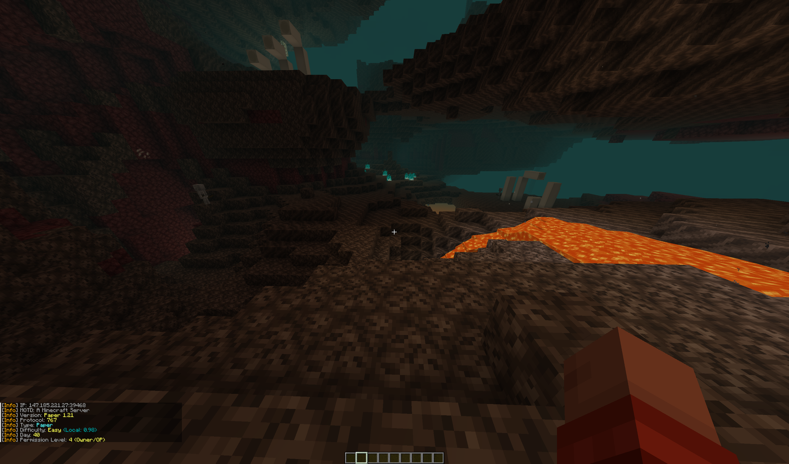
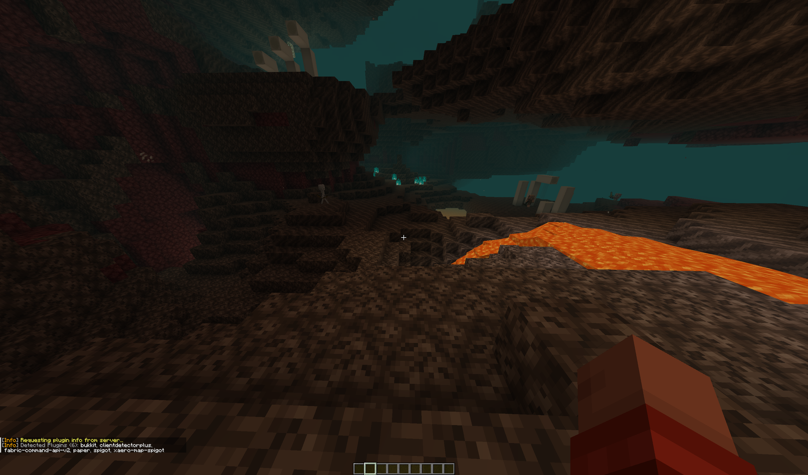
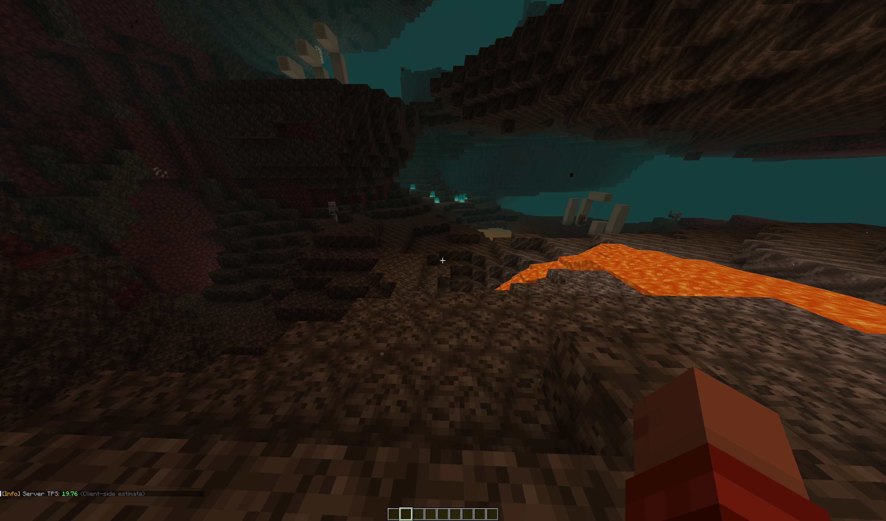

<!--  -->

  

<h1 align="center">Server Info Command</h1>

# Commands
- `/server`, `/server info` - show server info
- `/server tps` - get current server TPS
- `/server plugins` - get server plugins list

# Example

